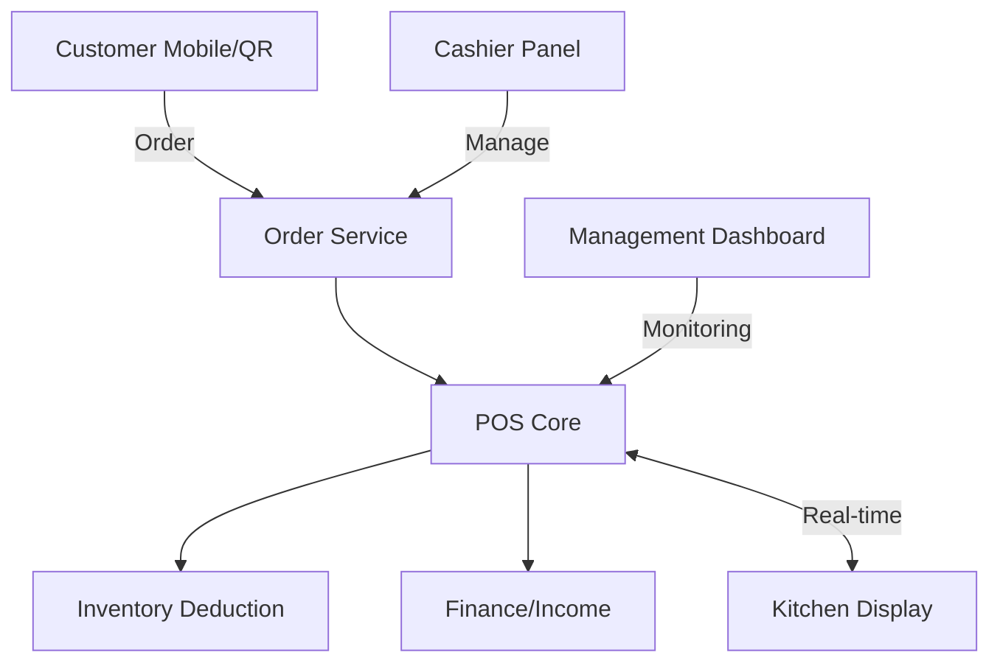

# BEGE-POS: Cafe & Resto Management System

## 📌 Project Overview
**BEGE-POS** is a comprehensive, modular, and scalable management system designed specifically for the Cafe & Restaurant industry. It integrates Point of Sale (POS) functionality with deep operational management, including inventory engines, HR/Payroll, financial reporting, and real-time customer interventions.

This project is built to handle everything from a single local cafe (like **Garasi 66 Coffee & Roastery**) to multi-branch enterprises and cloud kitchens.

---

## 🚀 Core Features

### 1. Point of Sale (POS) Core
- **Menu Management**: Categories, modifiers, and add-ons.
- **Table Management**: Real-time table availability and smart allocation.
- **Order Lifecycle**: From Draft to Served/Completed.
- **Flexible Ordering**: Support for Walk-in, Takeaway, and Online Orders.

### 2. Advanced Inventory Engine
- **Recipe & BOM**: Automatic raw material deduction upon sale.
- **Stock Opname**: Integrated inventory auditing.
- **Supplier Management**: Purchase order tracking and movement logs.

### 3. HR & Payroll
- **Employee Management**: Role-based access control (RBAC) via Spatie.
- **Attendance**: Shift tracking, late detection, and overtime management.
- **Payroll**: Automatic salary calculation including benefits and deductions.

### 4. Financial Management
- **Transactions**: Integration with QRIS, EDC, and Payment Gateways.
- **Financial Accounting**: Auto-journaling for income, expenses, and payroll.
- **Reporting**: Advanced analytics for sales, top menus, and P&L.

### 5. Reservation System
- **Engine**: State-machine driven reservation flow.
- **Notification**: Real-time alerts for customers and staff via FCM/Pusher.

---

## 🛠️ Technology Stack

### Backend (Web & API)
- **Framework**: Laravel 12
- **Database**: MySQL
- **Real-time**: Laravel Reverb / Pusher
- **Queue**: Redis
- **Styling**: Tailwind CSS / Livewire
- **Security**: Sanctum (Token-based Auth), Spatie Permission

### Mobile App (Customer & Staff)
- **Framework**: Expo / React Native
- **State Management**: NativeWind (Tailwind for mobile)
- **API**: Axios with Sanctum integration

---

## 🧱 Architecture



---

## 📦 Getting Started

### Prerequisites
- PHP 8.2+
- Node.js & NPM
- MySQL
- Redis

### Backend Installation
1. Clone the repository
2. Go to `01` directory
3. Run `composer install`
4. Copy `.env.example` to `.env` and configure database
5. Run `php artisan migrate --seed`
6. Run `php artisan serve`

### Mobile App Installation
1. Go to `02` directory
2. Run `npm install`
3. Configure your API base URL in `src/api/client.ts`
4. Run `npx expo start`

---

## 🔐 Security & Standards
- **CSRF & XSS Protection**: Built-in Laravel security layers.
- **Clean Code**: SOLID principles and Service Layer pattern implementation.
- **Responsive**: Mobile-first design for all interfaces.

---


# POS & Reservation System

A comprehensive, modern Point of Sale (POS) and Reservation system designed for restaurants and retail. Built on a robust tech stack featuring **Laravel 12** and **React 18** via **Inertia.js**, this application manages complex inventory (Recipes/BOM), real-time table reservations, order processing, and comprehensive back-office management (HR, Payroll, and Reports).

## Core Technologies

- **Backend:** Laravel 12, PHP 8.2+
- **Frontend:** React 18, Tailwind CSS 4, Inertia.js (SSR supported)
- **Broadcasting:** Laravel Reverb (WebSockets) + Echo
- **State Management:** Zustand (Frontend), Service/Action Pattern (Backend)
- **Database:** MySQL / SQLite
- **Key Packages:** Spatie Permission, Spatie Activity Log, DomPDF, Laravel Excel, SweetAlert

## Key Features

- **Real-time POS & Order Processing:** Fast, responsive POS interface synced in real-time.
- **Advanced Inventory Management:** Supports Bill of Materials (BOM), nested recipes, auto cost/availability calculation, and Stock Opname (blind count, variances, approval workflows).
- **Table Reservation System:** Real-time table locking and scheduling (Draft → Pending → Confirmed → Checked-In → Completed).
- **Back-office & HR:** Comprehensive staff management, hourly payroll tracking, late penalties, and role-based access control (RBAC).
- **Kitchen Display / Mobile:** Mobile-first UI for kitchen prep and stock counting.
- **AI-driven & Forecasting:** Demand forecasting for purchase planning and waste reduction recommendations.

## Architecture

This project follows a decoupled architecture blending standard Laravel with Domain-Driven Design (DDD) elements:
- **Actions/Services:** Business logic is abstracted into single-responsibility Action classes and Service Engines (e.g., `TableAvailabilityEngine`, `RecipeEngineService`).
- **DTOs & Events:** Strongly typed Data Transfer Objects for passing data and Event-driven hooks for side effects (e.g., `OrderPaid`, `StockAdjusted`).

## Getting Started

### Local Development (Sail / Valet)

1. Clone the repository and install dependencies:
   ```bash
   composer setup
   ```
   *(This command runs `composer install`, `.env` setup, `key:generate`, `migrate`, `npm install`, and `npm run build`)*

2. Start the development server:
   ```bash
   composer dev
   ```
   *(This runs `artisan serve`, queue listener, logs, and Vite concurrently)*

3. Start Laravel Reverb for WebSockets (if not started automatically):
   ```bash
   php artisan reverb:start
   ```

### Docker Deployment (Production Ready)

The project includes a multi-container Docker setup for production deployment.

1. Create your `.env` file based on `.env.example`:
   ```bash
   cp .env.example .env
   ```

2. Build and start the Docker containers:
   ```bash
   docker-compose up -d --build
   ```

This will spin up:
- **app**: PHP-FPM container
- **nginx**: Web Server mapped to port `80`
- **db**: MySQL 8.0
- **redis**: Redis for cache and queues
- **queue**: Background job processor
- **reverb**: WebSocket server mapped to port `8080`

The entrypoint script will automatically wait for the database, run migrations, and cache configurations.

## Testing & Linting

- **Testing:** `php artisan test`
- **Linting:** `php artisan pint`

## License

This project is proprietary and confidential. All rights reserved.

## 📄 License
Maintainer: **Garasi 66 Coffee & Roastery** / Build by **BEGE DEVS**
