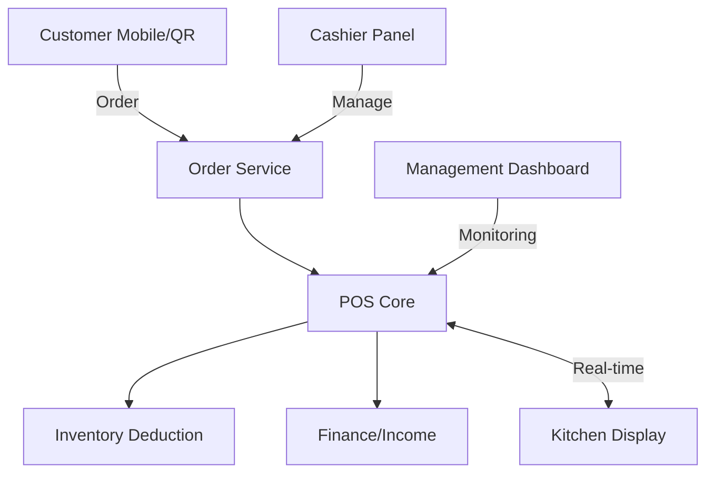

# BEGE-POS: Cafe & Resto Management System

## 📌 Project Overview
**BEGE-POS** is a comprehensive, modular, and scalable management system designed specifically for the Cafe & Restaurant industry. It integrates Point of Sale (POS) functionality with deep operational management, including inventory engines, HR/Payroll, financial reporting, and real-time customer interventions.

This project is built to handle everything from a single local cafe (like **Garasi 66 Coffee & Roastery**) to multi-branch enterprises and cloud kitchens.

---

## 🚀 Core Features

### 1. Point of Sale (POS) Core
- **Menu Management**: Categories, modifiers, and add-ons.
- **Table Management**: Real-time table availability and smart allocation.
- **Order Lifecycle**: From Draft to Served/Completed.
- **Flexible Ordering**: Support for Walk-in, Takeaway, and Online Orders.

### 2. Advanced Inventory Engine
- **Recipe & BOM**: Automatic raw material deduction upon sale.
- **Stock Opname**: Integrated inventory auditing.
- **Supplier Management**: Purchase order tracking and movement logs.

### 3. HR & Payroll
- **Employee Management**: Role-based access control (RBAC) via Spatie.
- **Attendance**: Shift tracking, late detection, and overtime management.
- **Payroll**: Automatic salary calculation including benefits and deductions.

### 4. Financial Management
- **Transactions**: Integration with QRIS, EDC, and Payment Gateways.
- **Financial Accounting**: Auto-journaling for income, expenses, and payroll.
- **Reporting**: Advanced analytics for sales, top menus, and P&L.

### 5. Reservation System
- **Engine**: State-machine driven reservation flow.
- **Notification**: Real-time alerts for customers and staff via FCM/Pusher.

---

## 🛠️ Technology Stack

### Backend (Web & API)
- **Framework**: Laravel 12
- **Database**: MySQL
- **Real-time**: Laravel Reverb / Pusher
- **Queue**: Redis
- **Styling**: Tailwind CSS / Livewire
- **Security**: Sanctum (Token-based Auth), Spatie Permission

### Mobile App (Customer & Staff)
- **Framework**: Expo / React Native
- **State Management**: NativeWind (Tailwind for mobile)
- **API**: Axios with Sanctum integration

---

## 🧱 Architecture

---

## 📦 Getting Started

### Prerequisites
- PHP 8.2+
- Node.js & NPM
- MySQL
- Redis

### Backend Installation
1. Clone the repository
2. Go to `01` directory
3. Run `composer install`
4. Copy `.env.example` to `.env` and configure database
5. Run `php artisan migrate --seed`
6. Run `php artisan serve`

### Mobile App Installation
1. Go to `02` directory
2. Run `npm install`
3. Configure your API base URL in `src/api/client.ts`
4. Run `npx expo start`

---

## 🔐 Security & Standards
- **CSRF & XSS Protection**: Built-in Laravel security layers.
- **Clean Code**: SOLID principles and Service Layer pattern implementation.
- **Responsive**: Mobile-first design for all interfaces.

---

## 📄 License
Maintainer: **Garasi 66 Coffee & Roastery** / Build by **BEGE DEVS**
